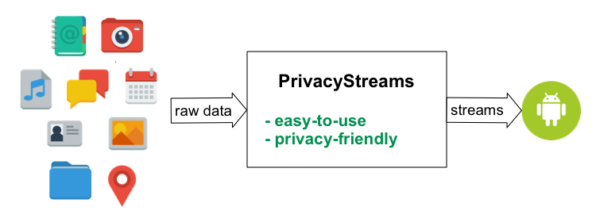

# PrivacyStreams

PrivacyStreams is a library for easy and privacy-friendly personal data processing.
It offers a functional programming model for accessing and processing various types of personal data.

## How to use

Please refer to our [website](https://privacystreams.github.io/).

## How to contribute

PrivacyStreams is open-sourced under license Apache-2.0, and we welcome developers add more data types and operations.
Please feel free to fork, open issues, and send pull requests.
You can install PrivacyStreams from source code.
For example, in Android Studio, the installation involves the following steps:

1. Create a new project from Github in Android Studio.
    - Click **File -> New -> Project from version control -> GitHub**;
    - In **Git repository URL** field, input `https://github.com/PrivacyStreams/PrivacyStreams`, and click **Clone**);
2. In the new project, create a new module (your app module).
    - Click **File -> New -> New module...**.
3. Open the build.gradle file of the new module, add the following line to dependencies:
    - `compile project(':privacystreams-core')`

Just keep in mind, as a library for personal data processing, we care much about security and privacy.
Please make sure your contributions meet the following requirements:

1. The new code is well-structured and well-documented;
2. The new code has been tested;
3. The new APIs are carefully designed (please refer to [Josh Bloch's API design guide](http://www.cs.cmu.edu/~charlie/courses/15-214/2016-fall/slides/13-api%20design.pdf));
4. No unnecessary class or method is exposed as public.

## Acknowledgments

- [CHIMPS Lab] and [SYNERGY Lab] at Carnegie Mellon University.
- Icons from [Paomedia on iconfinder.com](https://www.iconfinder.com/paomedia)
